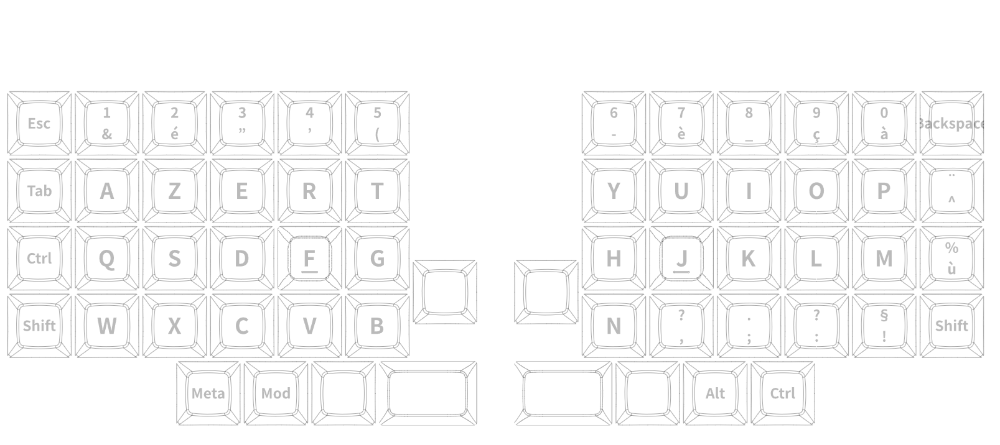

# Keyboard ZMK Firmware

- Instal <https://zmk.dev/docs/user-setup>

https://nickcoutsos.github.io/keymap-editor/

https://fkcaps.com/custom/create/language

DSA Profile Keycap

## layout

https://ergol.org/claviers/compacts/

https://github.com/MajykOyster/Aurora-Lily58/blob/main/README.md

https://keymapdb.com/?languages=French

https://ergol.org/claviers/compacts/

https://github.com/MajykOyster/Aurora-Lily58/blob/main/README.md

https://keymapdb.com/?languages=French

https://bepo.fr/wiki/Accueil

